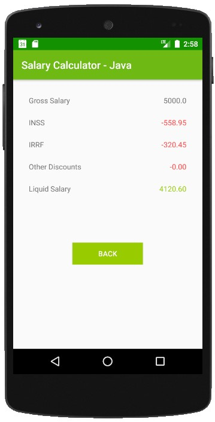

# Liquid salary calculator

The project is a calculator that returns Brazil base taxes and liquid salary based on input informations like salary, dependents and other discounts. 

It's my first project using Java for Android and I really enjoyed developing it! :computer:

## How to run?
Clone the repo, open the project in Android Studio, hit "Run". Done! :white_check_mark:

## Preview

